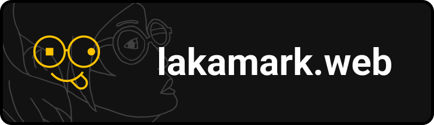

  

---

## Overview

This project is a personal web platform built with Symfony.  
It is designed to centralize my creative work, projects and community
interactions.

The application follows a domain-oriented architecture to keep business logic separated from HTTP and infrastructure concerns.

---

## Table of Contents

- [Overview](#overview)
- [Documentation](#documentation)
- [Architecture](#architecture)
- [Web Design Workflow](#web-design-workflow)
- [Project Roadmap](#project-roadmap)
- [Development](#development)
- [Issues](#issues)
- [Pull Requests](#pull-requests)
- [License](#license)

---

## Documentation

Project documentation is available in the `/docs` directory.

| Document               | Description                                 |
|------------------------|---------------------------------------------|
| `about-project.md`     | Vision and purpose of the project           |
| `architecture.md`      | Explanation of the application architecture |
| `design-principles.md` | Design principles used in the project       |
| `project-structure.md` | Organization of the source code             |
| `auth-flow.md`         | Authentication system workflows             |
---

## Architecture

The application architecture is organized into several layers in order
to separate responsibilities:

- **Domain** — core business logic
- **Http** — controllers and request handling
- **Foundation** — shared technical tools
- **Infrastructure** — external integrations

More details are available in the documentation.

---

## Web Design Workflow

The UI/UX design of the platform is developed using Figma.

To gather feedback from the community, the design template is publicly
available so people can review the interface and leave comments.

## Project Roadmap

### Core System
- [x] Domain architecture
- [x] Authentication system
- [ ] Content system
- [ ] Moderation system

### Platform Features
- [ ] Subscription system
- [ ] Public API

### Technical Improvements
- [ ] Performance optimizations
- [ ] CI / deployment improvements

## Development

Instructions for running the project locally will be documented here.

---

## Issues

If you encounter a bug or have a suggestion for improvement, feel free
to open an issue.

Please provide as much context as possible.

---

## Pull Requests

Pull requests are welcome.

If you want to contribute:

1. Fork the repository
2. Create a new branch
3. Commit your changes
4. Open a pull request with a clear description

---

## License

This project is licensed under the [MIT License](LICENSE.md).

The **Laka Mark** name and logo are not covered by the MIT License and
may not be used without permission.